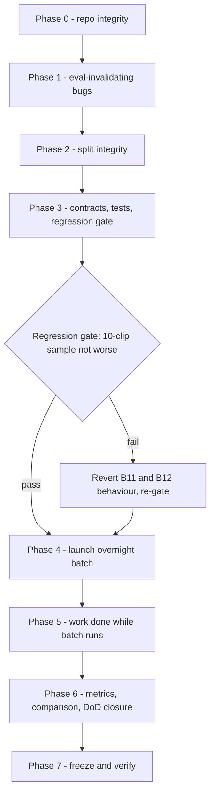

# RADS — MVP Completion Plan (Phased)

**Created:** 2026-09-20 21:40 IST
**Deadline:** 2026-09-21 10:00 IST
**Source of truth:** `docs/architecture/{MASTER_SPEC,AI,SYSTEM,TECH_STACK,MVP,IMPLEMENTATION_AUDIT_AND_ORDER,IMPLEMENTATION_TRACKER}.md`
**Basis:** Repository audit of 2026-09-20 (~72% against MVP §36, ~28% remaining)

---

## 1. Goal

Close the MVP as the specs define it, not as the tracker claims. Three outcomes:

1. Every bug in the register below is fixed or formally documented as a scoped limitation.
2. Evaluation is re-run on clean code and a leakage-documented split, so the numbers are trustworthy.
3. MVP §36 Definition of Done is ticked against evidence, with the P02 comparison table, confusion matrices, AUROC, FPR analysis, and at least five stage-attributed failure cases recorded in `IMPLEMENTATION_TRACKER.md`.

## 2. Decisions taken before planning

- **Evaluation re-run scope:** full re-run of both the P02 74-clip test split and a rebuilt, leakage-documented 500-clip held-out set, launched as one overnight batch.
- **Single-vehicle accidents (B9):** not implemented in this window. Reasoning stays pairwise. Recorded as a documented limitation with failure-case evidence.
- **Reasoning philosophy:** rule-based, per TECH_STACK §14 and audit Revision 2. No ML temporal model, no optical flow, no calibration.
- **Preservation mandate:** nothing in `training/`, `eda/`, `Datasets/`, `scripts/`, `scratch/`, `docs/` is deleted or rewritten.

## 3. Bug register and phase assignment

| ID | Defect | Phase |
|---|---|---|
| B1 | Tracker state persists across videos (`persist=True`, one `Tracker` reused by evaluator) | 1 |
| B2 | Evaluator reads `track_summaries`, schema emits `tracks_summary` — every record has `num_tracks: 0` | 1 |
| B3 | `extract_source_id` returns wrong source IDs; per-class uniqueness only; duplicate `video_id` breaks resume | 2 |
| B4 | `baseline_comparison.py` prints baseline column as `TBD`, never loads real P02 results | 5 |
| B5 | Evaluator swallows exceptions; a crashed video looks like a completed run | 1 |
| B6 | Severity missing score, evidence list, velocity, deceleration, post-impact displacement | 3 |
| B7 | Result still `get_stub_event_result` / `status: PHASE_5_COMPLETE`; `evidence_list` computed then dropped | 3 |
| B8 | Reasoner and severity thresholds hardcoded; `convergence_angle_threshold` in YAML but unread | 3 |
| B9 | Pairwise-only reasoning cannot detect single-vehicle accidents | 6 (documented) |
| B10 | Required Phase 3 and Phase 4 synthetic unit tests never written; `rads/` has no test suite | 3 |
| B11 | Involved-object clustering over-includes (10 IDs on one false positive) | 3 |
| B12 | Confidence saturates at 0.0 / 1.0, weakening AUROC | 3 |
| B13 | Hardcoded `e:\Rads\...` paths in `create_splits.py` | 2 |
| B14 | `--output-video` default directory is never created; `VideoWriter` fails quietly | 1 |
| B15 | `processed_frames` computed from `video` after its `with` block exits | 1 |
| **B16** | `.gitignore` rule `output/` hides `rads/output/` — `visualizer.py` and `event_schema.py` are untracked | 0 |
| **B17** | `.gitignore` rule `models/` hides `training/models/` — the ResNet18+GRU baseline is untracked, violating the Preservation Mandate | 0 |
| **B18** | `rads/evaluation/` has no `__init__.py` | 0 |

B16–B18 were found while planning and are not in the original audit body.

Status as of 22:15 IST: B16, B17, B18 closed (Phase 0). B4 closed (Phase 5). B3, B13 closed (Phase 2) — `rads/config/picek_heldout_split_v2.csv`, 250 same-source pairs drawn from 1,398 eligible, reproducible under seed 42, all 500 paths resolving. The old split is now measured, not just suspected: 454 true sources, 38 contributing multiple clips, and 29 duplicate `video_id` values across 58 rows, which would have made a resumed run skip rows. Four selected sources overlap the P02 test split and are reported rather than excluded. B16 refined on inspection — `rads/output/*.py` were already tracked, so the `output/` rule was a latent hazard that would have swallowed any newly added file there; the `models/` rule was actively hiding `training/models/*.py`.

B12 has a reporting dependency. Corrected count: the pre-fix `confidence` field takes 18 distinct values on the P02 set and 48 on the held-out set, not the three values recorded earlier here. The concern it pointed at is still real — 46 of 74 P02 rows (62.2 percent) and 307 of 500 held-out rows (61.4 percent) sit at exactly 0.0 or 1.0 — so both pre-fix AUROC figures are largely tie-broken and must not be read as ranking quality. The P02 comparison must be regenerated after B12 lands.

The pre-fix metrics are now confirmed by independent recount, twice, via direct iteration and via `compute_metrics`. The held-out 500 set: TN 187, FP 63, FN 135, TP 115, accuracy 0.6040, accident recall 0.4600, FPR 0.2520, macro F1 0.5956. The earlier concern that these came from capped grep counts was unfounded; the figures were correct. The P02 74-row set matches the independent verification on all twelve metrics.

B9 now has hard numbers rather than an assertion. The P02 split holds 16 rows with `collision_type` of `single`, forming 8 source pairs. Seven of the 8 single-vehicle positives were missed, five of them at confidence exactly 0.00. The single detected one, `picek_p02_pos_-dVU8qW4ik8_00`, is not a success: its `negative_pre_accident` twin from the same source also fired at confidence 1.00, so both clips were classified identically regardless of label.

Repository note, not a defect to fix: `rads/evaluation/experiments/frame_skip_comparison/forensics/FP_-6SQSDj8cYU_00.json` is misnamed. Its recorded result is `accident: false, confidence: 0.15` on a clip whose ground truth is normal, which is a correct rejection, and `comparison_summary.md` confirms that clip was predicted normal at both frame-skip settings. The file is evidence and stays as-is under the preservation mandate; the failure analysis uses it as a negative control and documents the mislabel.

## 4. Phase flow and gates

**Hard gate: the batch must be launched by 01:15 IST.** If Phase 3 is not finished by then, ship Phase 3 partially (B6, B7, B8 only; skip B11 and B12) and launch, because the 500-clip run needs 3-5 hours on CPU at `frame_skip=1`.

---

## Phase 0 — Repo integrity and version control (~20 min)

Nothing downstream is safe while the MVP's own output modules are untracked.

1. Create `.cursor/plans/` and keep this plan there.
2. `.gitignore`: add a Cursor section ignoring `.cursor/plans/`.
3. **B16/B17 fix — narrow the over-broad rules to root-anchored form.** In `.gitignore`, change:
   - `output/` and `output_results/` (Pipeline Outputs section) to `/output/` and `/output_results/`
   - `models/` (Models section) to `/models/`
   - `Outputs/` to `/Outputs/`
   Negation alone will not work here: git cannot re-include a path whose parent directory is excluded, so the parent rules must be narrowed rather than negated.
4. Add `rads/evaluation/__init__.py` (B18) and `rads/tests/__init__.py`.
5. Verify: `git check-ignore -v rads/output/visualizer.py training/models/temporal_model.py` returns no match, and `git status --porcelain` now lists `rads/output/*` and `training/models/*` as untracked-new.
6. Commit as a hygiene-only change with no behavioural edits.

**Verification (binary):** `rads/output/event_schema.py`, `rads/output/visualizer.py`, `training/models/temporal_model.py`, `training/models/classification_model.py`, `training/models/model_factory.py` are all visible to git. `*.pt` weights stay ignored.

---

## Phase 1 — Bugs that invalidate any evaluation (~45 min)

**B1 — tracker reset between videos.** Add `Tracker.reset()` in `rads/tracking/tracker.py`. Defensive implementation: if `self.model.predictor` exists and has `trackers`, call `reset()` on each; otherwise rebuild the `YOLO` instance. Call it at the start of `Pipeline.run()` in `rads/pipeline/pipeline.py`, so both `run_pipeline.py` and `rads/evaluation/evaluator.py` get isolation without either having to remember.

Verification test (`rads/tests/test_pipeline_isolation.py`): run video B standalone, then run A followed by B in the same `Pipeline`. Assert B's `accident`, `confidence`, and track-ID set are identical in both orders.

**B2 — schema key mismatch.** In `rads/evaluation/evaluator.py` the record must read `result.get("tracks_summary", {})` to match `rads/output/event_schema.py`. Also record `evidence_list` and `interaction_candidate_count` per video, since failure attribution in Phase 6 depends on them.

**B5 — no silent failures.** On exception, still write a JSONL row with `"status": "error"` and the message, then at the end of the run print a completeness check: rows written versus rows expected from the CSV, and fail loudly if they differ. Update `rads/evaluation/dashboard_updater.py` to count only successful rows.

**B14 — output directory.** In `run_pipeline.py`, `os.makedirs(os.path.dirname(...), exist_ok=True)` for both the result JSON and the annotated video before writing.

**B15 — frame accounting.** Capture `total_frames` and `fps` into locals inside the `with VideoReader(...)` block in `Pipeline.run()` and compute `processed_frames` from those.

**Verification:** isolation test passes; a deliberate bad path in a 3-row CSV produces an `error` row plus a loud completeness failure; a fresh `--visualize` run into a non-existent directory produces a playable file.

---

## Phase 2 — Split integrity and portability (~45 min)

**B3 — source IDs.** Replace `extract_source_id` in `rads/config/create_splits.py` with: strip the extension, strip a trailing `_<2-digit variant>`, then strip one further trailing `_<digits>` clip index. This maps `GnpwLP2THmM_2_00.mp4`, `AuQz_-J2kzc_5_00.mp4`, `651RQwxB3WA_12_00.mp4`, `c_u8oPMBGEI_01.mp4`, `__WFqm4i3vE_00.mp4` and `russia23_00.mp4` correctly, where the current `'_'.join(parts[:-1])` does not.

**Split policy (write it down, do not leave it implied).** Rebuild the held-out set as explicit same-source pairs: choose sources that have both a positive and a `negative_pre_accident` clip, take both, up to 250 pairs. Rationale, to be recorded in the tracker:

- Spec-compliant. MVP §13 and MASTER_SPEC §14 require clips from one source to stay *within one split*. Pairing satisfies that; the MVP pipeline has no trained parameters, so there is nothing to leak into.
- It makes every negative a hard negative from the same camera and scene (MVP §12), which is what the false-positive problem actually needs.
- Rejected alternative: disjoint sources per class, which would reintroduce appearance-based separability between accident and normal.

**Unique IDs.** Emit `video_id` as `picek_pos_<basename>` / `picek_neg_<basename>`, the convention `p02_test_split.csv` already uses. Today the same basename appears with both labels, and because `evaluator.py` keys checkpoint recovery on `video_id`, a resumed run would silently drop the second occurrence.

**Tuning exclusions.** Exclude sources used to tune thresholds in Phases 1-7: the first 30 sorted files per class already skipped, plus the clips named in `docs/NEW.md` and in both experiment directories (`-6SQSDj8cYU`, `-dmYsQc-odI`, `-2UPLUV7JLg`, `-9oifpjUxxM`, `-7-vQ4obVwQ`, `-AztVDZ6cEE`, `-FQxK6HdxNU`, `-NgnSm_oEB4`, `-PpBteU0p3Q`, `-PpjzmhI_PE`, `-Qt5bDJNT84`, `-RE3XseZINA`, `-RrDtLjWsT4`, `-SNFUobKjoM`). The claim to publish is "held out from threshold tuning", not "held out from P02"; P02 source overlap is reported as a transparency note, not silently excluded.

**B13 — portability.** Take dataset roots from `rads/config/pipeline_config.yaml` or CLI arguments with repo-relative defaults; no `e:\Rads\` literals.

**Pre-flight, before any long run.** Print pool size per class, unique sources after correction, pairable sources found, and the final pair count. If fewer than 250 pairs exist, take what exists, keep it balanced, and record the real number rather than falling back to an unbalanced grab as the current script does.

**Verification:** a check script asserts zero duplicate `video_id`, exact class balance, zero tuning-source contamination, and every `processed_path` exists on disk. Write the source-overlap summary to `rads/evaluation/split_integrity_report.md`.

---

## Phase 3 — Complete the contracts, then freeze (~2 h)

Everything that changes a prediction must land before the batch. Nothing in this phase may be touched afterwards.

**B6 — severity to the Phase 6 contract.** Rewrite `rads/severity/severity_engine.py` to return `{severity, score, evidence: [{factor, value, contribution}, ...]}` over the documented factors: object count, vulnerable-class involvement, peak relative velocity, magnitude of velocity change (deceleration), post-impact displacement. Weights and the LOW/MEDIUM/HIGH cut-offs live in YAML. Document the formula in the module docstring and in `IMPLEMENTATION_TRACKER.md`, and state plainly that it is an engineered heuristic with no ground truth, per MVP §21 and TECH_STACK §14.

**B7 — real structured output.** Rename `get_stub_event_result` to `build_event_result`, drop `status: PHASE_5_COMPLETE`, carry `evidence_list` and the severity object into the saved JSON, and emit `objects_involved` as `[{id, class}]` per SYSTEM §21. Keep `accident_type: "unknown"` as an explicit P1 placeholder rather than omitting the field.

**B8 — configuration.** Move to `rads/config/pipeline_config.yaml`: reasoning weights (velocity 0.4, IoU 0.3, overlap 0.2), the track-loss boost and its guard thresholds, deceleration thresholds, the 0.5 accident threshold, the velocity window of 15 frames, the 3.0 s clustering window, and severity weights and cut-offs. Either wire `convergence_angle_threshold` into `interaction_engine.py` or delete it; a config key that nothing reads is a lie about configurability.

**B11 — clustering discipline.** Keep temporal clustering but require a merged candidate to share an ID *and* carry its own qualifying evidence, and cap `objects_involved`. Config-gated so it can be switched off if the gate below fails.

**B12 — usable confidence.** Keep the accident decision exactly as it is, on the raw score against the configured threshold, so no label flips from this change. Report confidence as a bounded monotone transform of the raw score (for example `1 - exp(-score / scale)`) so ties break and AUROC becomes meaningful. Record both `score` and `confidence`.

**B10 — the tests the tracker claimed.** In `rads/tests/`, using `unittest` to match `training/tests/`:
- `test_motion_features.py` — synthetic trajectory with known positions; assert expected velocity sign and magnitude, near-zero velocity after a stop, and correct acceleration.
- `test_interactions.py` (unit, distinct from the existing 6-clip runner) — two synthetic tracks on a collision course produce a candidate; two parallel tracks produce none.
- `test_severity.py` — a high-speed multi-vehicle event scores above a minor one; evidence list is non-empty and traceable.
- `test_split_integrity.py` — `extract_source_id` cases above; no duplicate IDs.
- `test_pipeline_isolation.py` from Phase 1.

**Regression gate.** Re-run the 10-clip sample from `rads/evaluation/experiments/track_loss_reasoning_fix/` at `frame_skip=1` and compare against its recorded 6/10, 3 FP, 1 FN. Accept if accuracy is not worse and false positives do not increase. If it regresses, revert B11 and B12 behaviour, re-gate, and note it in the report. Store the outcome under `rads/evaluation/experiments/mvp_freeze_regression/`.

**Verification:** all unit tests pass; the gate passes or is explicitly rolled back; a config snapshot of effective values is written next to the results.

---

## Phase 4 — Launch the overnight batch (gate by 01:15 IST)

0. **Pre-gate, mandatory.** Phase 2 verified `picek_heldout_split_v2.csv` only as a definition: paths resolve, no duplicate IDs, balance exact. It has never been consumed by the evaluator, and the evaluator was being rewritten in parallel. Before committing 3-5 hours of compute, run the new evaluator over a 3-clip slice of the new CSV and confirm real rows are written with a non-zero `num_tracks`, a populated `evidence_list`, and no error rows. A `num_tracks` of zero here means the B2 fix did not land and the batch would produce another unusable file.
1. Phase 2 already rebuilt the held-out split. Verify `git status` still shows `picek_500_split.csv` and `p02_test_split.csv` unmodified before proceeding.
2. Launch P02 first — 74 clips, roughly 15-30 min — into `rads/evaluation/p02_test_results_v2.jsonl`. Keep the pre-fix files; do not overwrite evidence.
3. Launch the rebuilt held-out set into `rads/evaluation/picek_heldout_results_v2.jsonl`.
4. Record the exact commands, the commit SHA, the effective config, and the start time in the tracker's Configuration Snapshot, satisfying the MVP §36 provenance item.
5. Leave `dashboard_updater.py` running against the new file with the correct total.

**Verification:** both runs reach row-count parity with their CSVs and report zero `status: error` rows. Any error rows are triaged in Phase 6 rather than hidden.

---

## Phase 5 — Work that runs in parallel with the batch

Nothing here can change a prediction.

**B4 — a real baseline comparison.** Point `rads/evaluation/baseline_comparison.py` at the genuine artifacts. Note that `training/p02_prediction.json`, which the audit document cites, contains a single video (`jD8ybdMZOU8_00.mp4`) and is a demo dump, not test-set predictions. The real ones are:
- `training/outputs/2026-08-31_19-55-16/predictions/test_predictions.json` — keys `predictions`, `targets`, `confidences`, `class_names`, `label_mode`. The per-video probability pairs are under `confidences`, not `probabilities`.
- `training/outputs/2026-08-31_19-55-16/metrics/test_metrics.json` — accuracy 0.4595, macro F1 0.40705, AUROC 0.53470, accident F1 0.58333, normal F1 0.23077, confusion `[[6, 31], [9, 28]]`. Baseline AUROC is read from this artifact rather than recomputed. The spec-value fallback yields accuracy 0.4590 because MASTER_SPEC §15 and MVP §15 round to three places; the output states which source was used.

`targets` alternates 1, 0, 1, 0 in the same pos/neg order as `rads/config/p02_test_split.csv`, so index-aligned per-video comparison is valid. Assert `targets[i] == binary_label[i]` for all 74 rows and abort on mismatch rather than reporting a misaligned table. Because `training/outputs/` is gitignored, also accept a `--baseline-metrics` override and fall back to the values recorded in MASTER_SPEC §15 and MVP §15, so the table is reproducible on a clean clone.

**Visualization finish (Phase 7 spec gaps).** Add the impact timestamp to the overlay in `MM:SS.s` form per TECH_STACK §16 and the optional end-of-video summary frame. Confirm no event marker appears on a normal clip.

**Demo artifacts (MVP §35).** Produce two annotated videos plus evidence clips — one true positive with a visually correct impact time, one normal clip with no marker — and note their paths in the tracker.

**Report scaffolding.** Prepare the tracker sections for Phase 8 so Phase 6 is filling in numbers, not designing tables.

---

## Phase 6 — Metrics, comparison, and Definition-of-Done closure

1. Compute and record for both result sets: accuracy, balanced accuracy, per-class precision, recall and F1, macro F1, AUROC, confusion matrix, FPR, FNR. Publish them in `IMPLEMENTATION_TRACKER.md`, not only in JSONL.
2. Publish the side-by-side P02 table on identical metrics, following the reduction protocol in audit §5, and state the tradeoff honestly: the pre-fix run already showed a much lower false-positive rate with worse accident recall than the baseline.
3. Severity distribution over predicted accidents, with the no-ground-truth caveat stated (MVP §21).
4. Event-localization commentary where the metadata gives an `accident_time`: `p02_test_split.csv` carries `accident_time` and `accident_frame`, so impact-time error is computable for the P02 set. Report it as descriptive evidence, not a validated metric.
5. **At least five failure cases with the failing stage named** (MVP §28, Phase 8 requirement). Seed from the forensics already on disk and re-confirm post-fix:
   - `-2UPLUV7JLg_00` accident, FN — interaction stage, zero candidates, objects never close in image space
   - `-9oifpjUxxM_00` accident, FN — same class
   - `-FQxK6HdxNU_00` accident, FN — reasoning stage, candidates exist, score 0.40 below threshold
   - `-NgnSm_oEB4_00` normal, FP — reasoning stage, dense traffic, track-loss plus deceleration fire
   - a single-vehicle FN from P02 (`SBIUNqe_XTk`, `o5neAPqmNm8`, `71QSBkIXKXI`, `HXttLdePt0k`, `0puo8kJOlmU` or `7m77G8C7hiE`) — interaction stage, structurally impossible for pairwise reasoning
6. **B9 as a documented limitation.** Record in the tracker and in a Limitations section: reasoning is pairwise, so single-vehicle events cannot produce a candidate; the affected clip types are named; the fix is a P1 single-track anomaly path. This is the honest-measurement requirement of MVP §38, not an excuse.
7. Correct the tracker's Phase 6, 7 and 8 records, which currently claim completion that did not hold, and fill the Configuration Snapshot line that still reads "severity thresholds: to be decided".
8. Tick MVP §36 item by item with a pointer to the evidence for each. Mark the dashboard and Telegram item as vacuously satisfied, per audit Part 5.

**Verification:** every §36 Pipeline, Evaluation and Engineering box is either ticked with evidence or listed as an explicit, justified deviation. No box is left ambiguous.

---

## Phase 7 — Freeze and verify (~30 min)

1. Clean-clone smoke test: from a fresh checkout, install requirements, run `python run_pipeline.py --video <clip> --config rads/config/pipeline_config.yaml --output results.json --visualize` and confirm it works without the gitignored artifacts.
2. Run the full `rads/tests/` suite.
3. Confirm the Preservation Mandate: no file under `training/`, `eda/`, `Datasets/`, `scripts/`, `scratch/` or `docs/` was deleted or rewritten; `git log --diff-filter=D` is clean for those paths.
4. Final tracker update: Phase 8 marked complete only if every §36 box is closed. If anything remains open, mark it "Complete with documented deviations" and list them. Do not repeat the earlier mistake of marking a phase complete while its verification criteria fail.

---

## 5. Risks and rollback

| Risk | Mitigation |
|---|---|
| 500-clip run overruns 10:00 | P02 runs first and is independently reportable. The held-out run resumes from JSONL, so a partial run is still usable if the processed count is reported honestly. |
| B11 or B12 regress the 10-clip gate | Both are config-gated. Revert to current behaviour, re-gate, note it. |
| Tracker reset (B1) shifts all results versus the pre-fix run | Expected and correct. Pre-fix files are kept and the change is stated as the reason results moved. |
| Fewer than 250 pairable sources | Take what exists, keep balance, record the real count. Never silently fall back to an unbalanced grab. |
| Narrowing `.gitignore` sweeps in large artifacts | Verify with `git status --porcelain` before committing; `*.pt`, `*.mp4` and `training/outputs/` stay ignored. |

## 6. Deliverables

- `.gitignore` corrected; `rads/output/` and `training/models/` tracked
- `rads/tests/` suite, including the two synthetic tests Phase 3 and Phase 4 always required
- `rads/config/pipeline_config.yaml` holding every reasoning and severity parameter
- `build_event_result` producing a spec-shaped JSON with evidence and severity detail
- Rebuilt split CSVs plus `rads/evaluation/split_integrity_report.md`
- `p02_test_results_v2.jsonl`, `picek_heldout_results_v2.jsonl`, and a working baseline comparison table
- Two annotated demo videos with evidence clips
- `IMPLEMENTATION_TRACKER.md` carrying real metrics, the P02 comparison, five stage-attributed failure cases, documented limitations, the configuration snapshot, and a completed MVP §36 checklist
